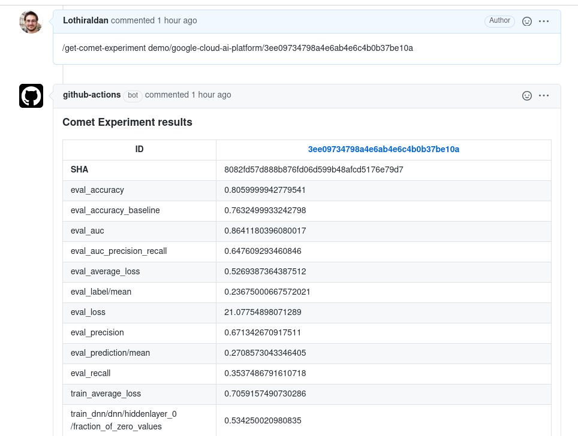

# Comet.ml Github Actions examples

This repository contains Github Actions to interact with the Comet.ml API.

## Chatops

The [chatops Github Action](https://github.com/comet-ml/mlops-actions-test/blob/master/.github/workflows/chatops.yml) support the following commands:

### Get Comet Experiment

If you want to get a summary information about a given experiment in a github PR, you can write a comment in the following format:

```
/get-comet-experiment WORKSPACE/PROJECT_NAME/EXPERIMENT_ID
```

This will retrieve the information from the Comet.ml API and write back a Github comment with a summary of the current value of the experiment metrics and hyper-parameters.

The file implementing this chatops action is located in [actions_files/get_comet_experiment.py](actions_files/get_comet_experiment.py).

This chatops action require to have access to a Github secret named `COMET_API_KEY` that is set to the Comet API Key that have access to the wanted experiments.

Here is an example:



You can try it yourself, first find a public experiment in the [demo workspace](https://www.comet.ml/demo), note its project name and experiment id, then on any pull-request (for example [the first one](../../pull/1)) comment like this:

```
/get-comet-experiment demo/PROJECT_NAME/EXPERIMENT_ID
```